# Getting Started with LoseIt
LoseIt is an application that aims to assist individuals in adopting a healthier lifestyle by tracking their daily caloric intake, macronutrients, and weight. By keeping track of their food intake, users can gain insight into their eating habits and make informed decisions about their diet.

## Quick Demo

## Sample Images

### Desktop View
| Start Page | Login Page | Dashboard |
|:---:|:---:|:---:|
|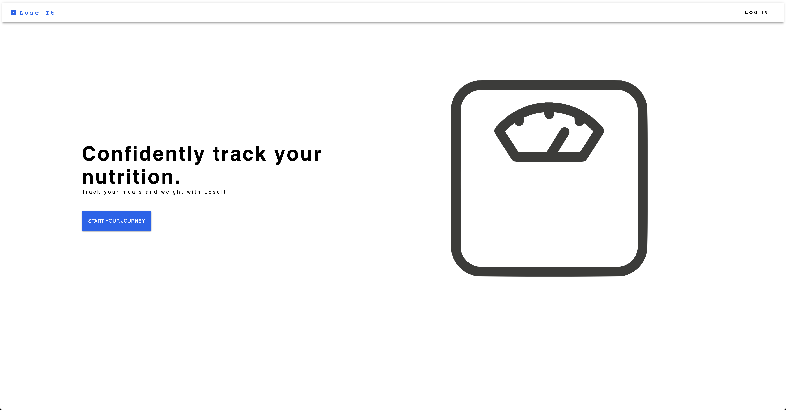|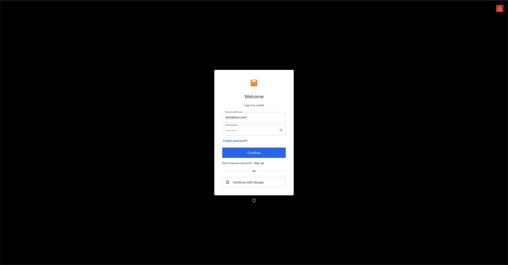|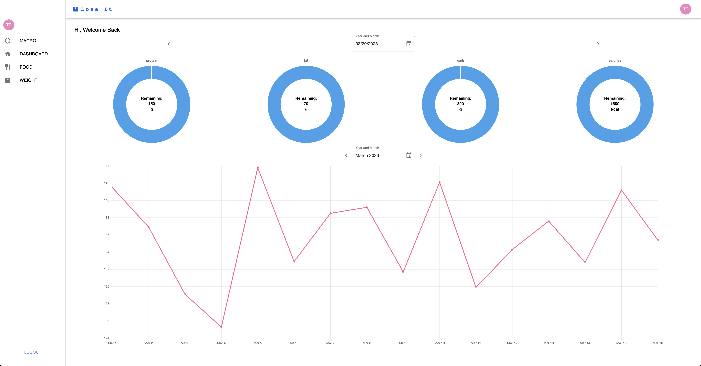|

| Weight Page | Food Page | Macro Page |
|:---:|:---:|:---:|
|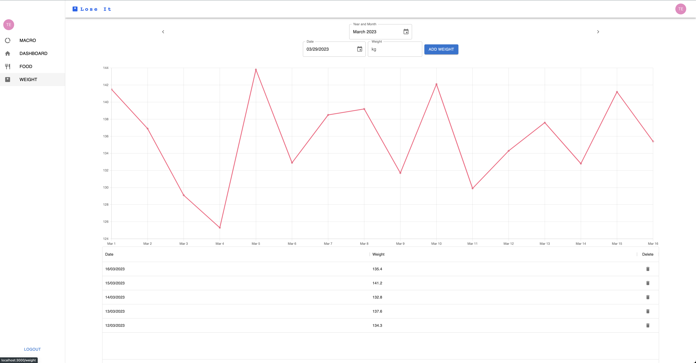|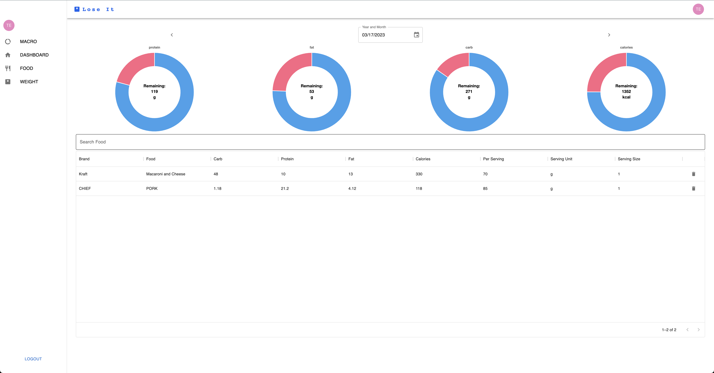|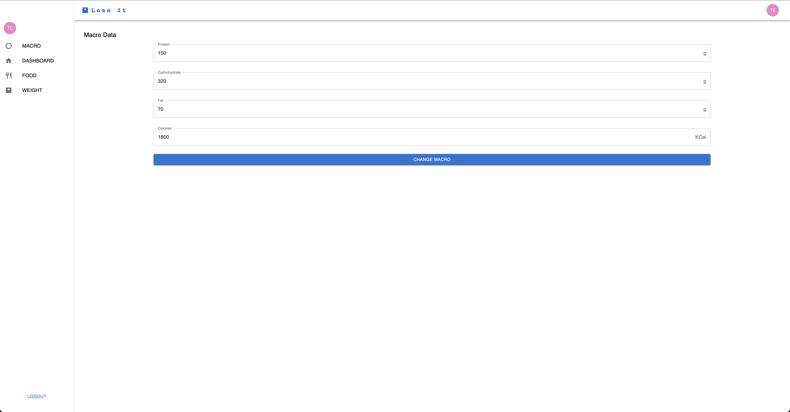|

### Tablet View
| Start Page | Dashboard| Sidebar|
|:---:|:---:|:---:|
|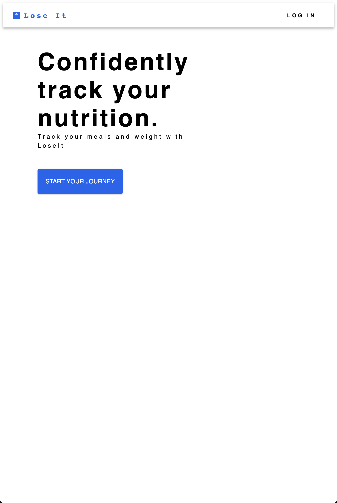|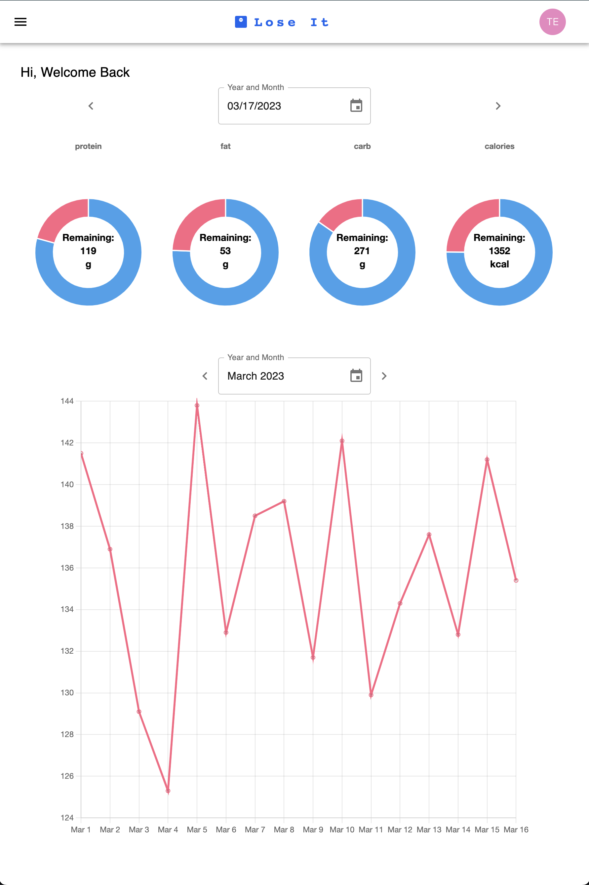|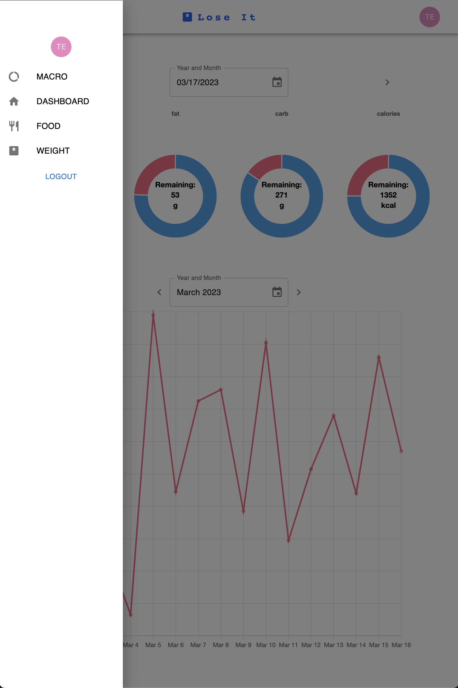|

| Weight Page | Food Page | Macro Page |
|:---:|:---:|:---:|
|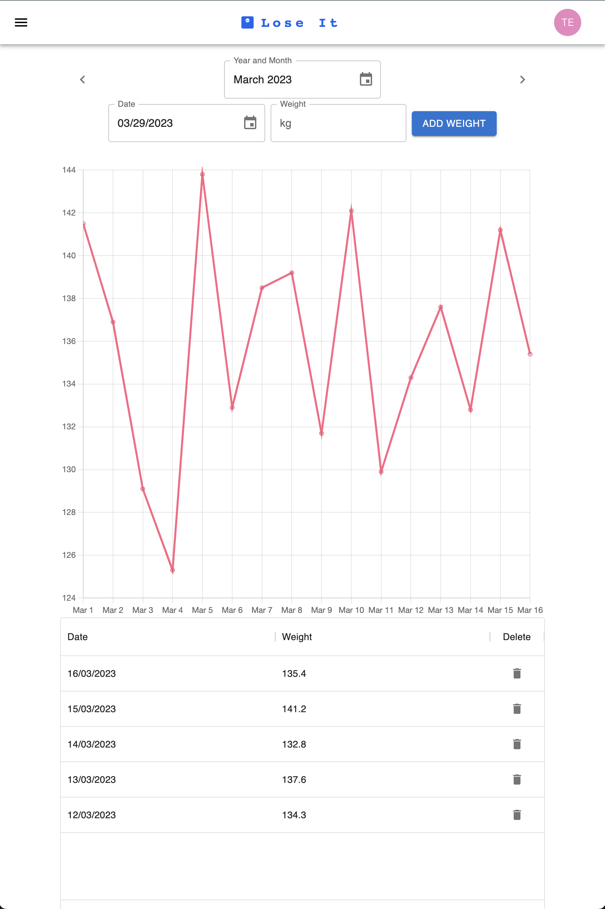|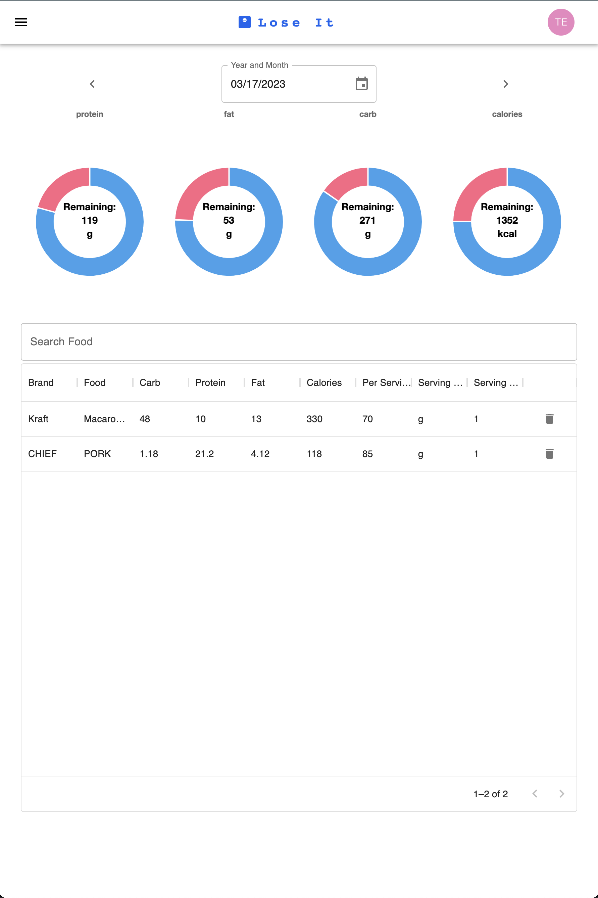|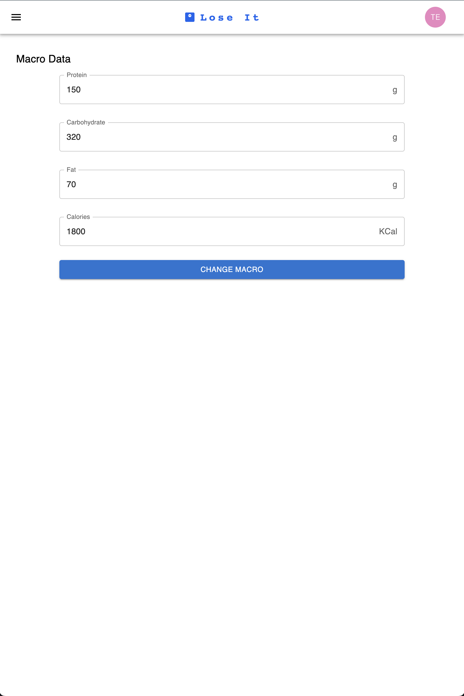|

### Phone View
| Start Page | Dashboard Top | Dashboard Bottom|
|:---:|:---:|:---:|
||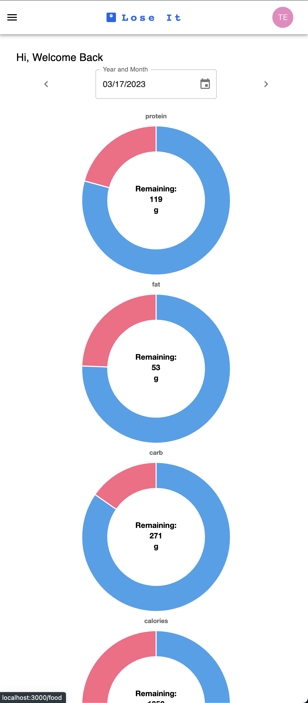||

| Weight Page | Food Page | Macro Page |
|:---:|:---:|:---:|
|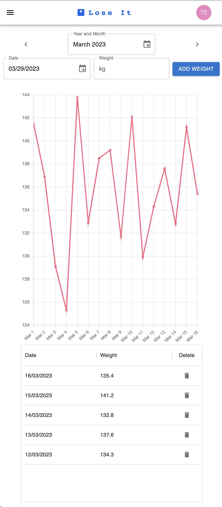|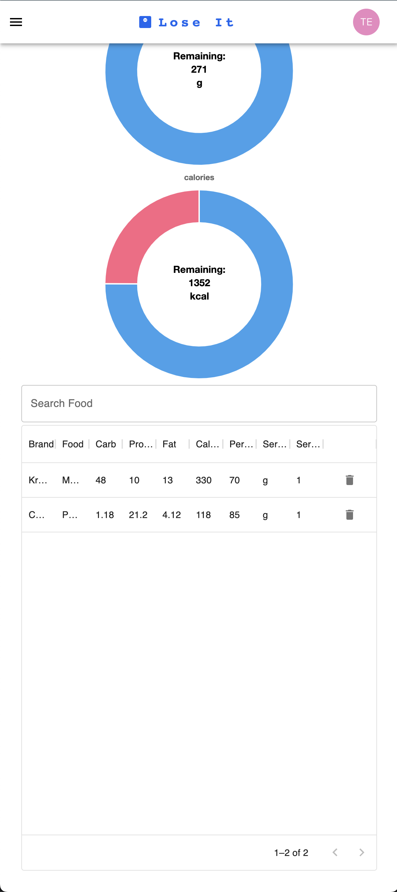|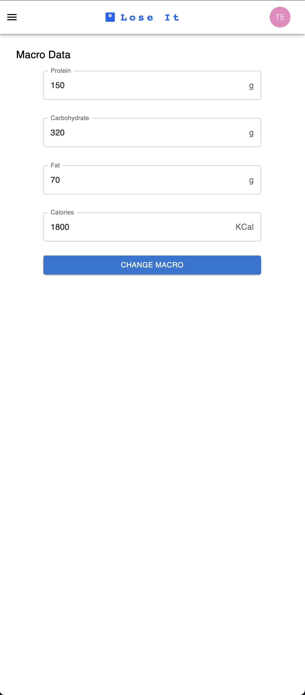| 